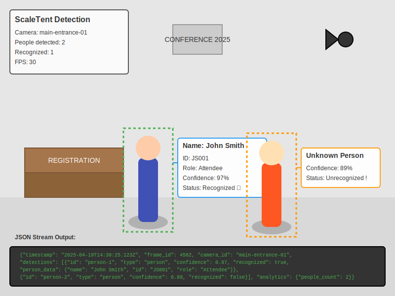

# ScaleTent

<p align="center">
  
</p>

<p align="center">
  <strong>Real-time Meet & Greet System with YOLOv8 and OpenCV</strong>
</p>

<p align="center">
  <a href="#key-features">Features</a> •
  <a href="#architecture">Architecture</a> •
  <a href="#installation">Installation</a> •
  <a href="#usage">Usage</a> •
  <a href="#deployment">Deployment</a> •
  <a href="#privacy">Privacy</a> •
  <a href="#license">License</a>
</p>

ScaleTent is an intelligent person detection and identification system designed for events, conferences, and corporate settings. It uses the latest YOLOv8 object detection model with OpenCV integration to identify people in real-time and provide contextual information via a JSON stream.

## Key Features

- **Real-time Person Detection**: Utilizes YOLOv8 for accurate and fast person detection in live video feeds
- **Face Recognition**: Identifies registered individuals in the system database
- **JSON Data Streaming**: Provides real-time data streams of detection results via WebSockets
- **Multi-Camera Support**: Scales to handle multiple camera inputs simultaneously
- **Interactive Web Dashboard**: Intuitive interface for monitoring and configuration
- **Privacy Controls**: Configurable privacy settings and data retention policies
- **Containerized Deployment**: Docker support for easy deployment

## Architecture

<p align="center">
  
</p>

The ScaleTent system consists of the following components:

<p align="center">
  
</p>

### 1. Input Layer
- Multiple camera feeds support (USB, IP cameras, RTSP streams)
- Video preprocessing for optimal detection performance

### 2. Processing Layer
- YOLOv8 detection engine for person identification 
- OpenCV integration for image processing
- TensorRT acceleration for improved inference speed

### 3. Recognition System
- Face detection and recognition pipeline
- Feature extraction and matching algorithms
- Database of registered attendees

### 4. Data Streaming Layer
- Real-time JSON output of detection results
- WebSocket server for live data feeds
- RESTful API for system integration

### 5. Visualization Layer
- Web dashboard for system monitoring
- Event analytics and reporting
- Administrative controls

## JSON Stream Format

```json
{
  "timestamp": "2025-04-19T14:30:25.123Z",
  "frame_id": 4562,
  "camera_id": "main-entrance-01",
  "detections": [
    {
      "id": "person-1",
      "type": "person",
      "confidence": 0.97,
      "bbox": [120, 80, 210, 380],
      "recognized": true,
      "person_data": {
        "name": "John Smith",
        "id": "JS001",
        "role": "Attendee",
        "registration_time": "2025-04-19T09:15:30Z"
      }
    },
    {
      "id": "person-2",
      "type": "person",
      "confidence": 0.89,
      "bbox": [450, 100, 520, 390],
      "recognized": false
    }
  ],
  "analytics": {
    "people_count": 2,
    "recognized_count": 1
  }
}
```

## System Requirements

### Hardware Requirements

- NVIDIA GPU with at least 8GB VRAM (recommended for optimal performance)
  - For Apple Silicon (M1/M2/M3): Built-in GPU with Metal support
- Intel i7/i9 or AMD Ryzen 7/9 CPU
  - For Apple Silicon: M1/M2/M3 chip
- 16GB+ RAM
- USB 3.0 ports for camera connections
- High-quality webcams or IP cameras (1080p minimum recommended)

### Software Requirements

- Python 3.8+
- OpenCV 4.7+
- PyTorch 2.0+
  - For NVIDIA: CUDA 11.7+ (for GPU acceleration)
  - For Apple Silicon: macOS 12.3+ (for MPS acceleration)
- Ultralytics YOLOv8
- MongoDB (optional, for advanced database storage)

## Installation

### Option 1: Manual Installation

1. Clone the repository
   ```bash
   git clone https://github.com/your-org/scaletent.git
   cd scaletent
   ```

2. Set up the environment
   ```bash
   # Run the setup script
   bash scripts/setup_environment.sh
   
   # Or manually:
   python -m venv venv
   source venv/bin/activate  # On Windows: venv\Scripts\activate
   
   # For NVIDIA GPU:
   pip install -r requirements.txt
   
   # For Apple Silicon (M1/M2/M3):
   pip install --pre torch torchvision torchaudio --extra-index-url https://download.pytorch.org/whl/nightly/cpu
   pip install -r requirements.txt
   ```

3. Configure GPU Support
   ```bash
   # For Apple Silicon, add this to config/config.yaml:
   device: mps  # Use Metal Performance Shaders for GPU acceleration
   ```

4. Download required models
   ```bash
   python scripts/download_models.py
   ```

5. Configure the system
   ```bash
   cp config/config.example.yaml config/config.yaml
   cp config/privacy_settings.example.yaml config/privacy_settings.yaml
   # Edit these files to match your environment
   ```

### Option 2: Docker Installation

1. Clone the repository
   ```bash
   git clone https://github.com/your-org/scaletent.git
   cd scaletent
   ```

2. Configure the system
   ```bash
   # Copy configuration files
   cp config/config.example.yaml config/config.yaml
   cp config/privacy_settings.example.yaml config/privacy_settings.yaml
   cp nginx/nginx.example.conf nginx/nginx.conf
   cp nginx/conf.d/default.example.conf nginx/conf.d/default.conf
   
   # Create required directories
   mkdir -p data logs nginx/ssl
   
   # Edit configurations as needed
   nano config/config.yaml
   ```

3. Set up SSL (Optional, recommended for production)
   ```bash
   # Generate self-signed certificates
   openssl req -x509 -nodes -days 365 -newkey rsa:2048 \
       -keyout nginx/ssl/private.key \
       -out nginx/ssl/certificate.crt
   ```

4. Run with Docker Compose
   ```bash
   # Build and start all services
   docker-compose up -d
   
   # View logs
   docker-compose logs -f
   
   # Check service status
   docker-compose ps
   ```

5. Access the services:
   - Web Interface: `http://localhost:5000` (or `https://localhost` if SSL configured)
   - WebSocket API: `ws://localhost:8765`
   - MongoDB: `mongodb://localhost:27017`
   - Redis: `redis://localhost:6379`

6. Managing containers:
   ```bash
   # Stop all services
   docker-compose down
   
   # Restart a specific service
   docker-compose restart scaletent
   
   # View service logs
   docker-compose logs -f scaletent
   
   # Scale services (if needed)
   docker-compose up -d --scale scaletent=2
   ```

7. Updating:
   ```bash
   # Pull latest changes
   git pull origin main
   
   # Rebuild and restart services
   docker-compose up -d --build
   ```

8. Troubleshooting:
   ```bash
   # Check container status
   docker ps -a
   
   # View container logs
   docker logs scaletent-app
   
   # Access container shell
   docker exec -it scaletent-app /bin/bash
   
   # Check resource usage
   docker stats
   ```

The Docker setup includes the following services:
- **ScaleTent App**: Main application with YOLOv8 and face recognition
- **MongoDB**: Database for storing profiles and analytics
- **Redis**: Caching and real-time message broker
- **Nginx**: Web proxy with SSL termination

Volume mounts:
- `./config`: Configuration files
- `./data`: Application data and models
- `./logs`: Application logs
- `./nginx`: Nginx configuration and SSL certificates

Exposed ports:
- 80/443: HTTP/HTTPS (Nginx)
- 5000: Web interface
- 8765: WebSocket API
- 27017: MongoDB
- 6379: Redis

### Docker Installation for Apple Silicon

For Apple Silicon users, we provide a specific Docker setup:

1. Use the same initial setup steps as above

2. Build the Docker image for Apple Silicon:
   ```bash
   # Use the Apple Silicon specific Dockerfile
   docker-compose -f docker-compose.apple-silicon.yml build
   
   # Start the services
   docker-compose -f docker-compose.apple-silicon.yml up -d
   ```

Note: The Metal GPU acceleration will be automatically used when running on Apple Silicon machines with proper configuration.

## Running on Apple Silicon (M1/M2/M3)

For Apple Silicon Macs, we provide a streamlined setup process with optimized configurations for Metal GPU acceleration.

### Quick Start (Recommended)

The easiest way to run ScaleTent on Apple Silicon is using our automated setup script:

```bash
# Make the script executable
chmod +x run-on-mac.sh

# Run the setup script
./run-on-mac.sh
```

The script will:
- ✅ Verify system requirements
- 🧹 Clean up any existing containers
- 📁 Set up necessary directories
- ⚙️ Configure the environment
- 🚀 Build and start all services
- 🔍 Check service health
- 📝 Show access information

### Manual Setup

If you prefer to set up manually, follow these steps:

1. **Check System Requirements**
   ```bash
   # Verify you're on Apple Silicon
   uname -m  # Should output: arm64
   
   # Check Docker installation
   docker --version
   docker-compose --version
   ```

2. **Configure Environment**
   ```bash
   # Create required directories
   mkdir -p data/models data/db logs config
   
   # Copy example config
   cp config/config.example.yaml config/config.yaml
   ```

3. **Build and Run Services**
   ```bash
   # Build containers
   docker-compose -f docker-compose.apple-silicon.yml build
   
   # Start services
   docker-compose -f docker-compose.apple-silicon.yml up -d
   ```

### Service Access

Once running, access the services at:
- 📊 Web Interface: `http://localhost:8501`
- 🔧 API: `http://localhost:8000`
- 💾 MongoDB: `mongodb://localhost:27017`
- 📡 Redis: `redis://localhost:6379`

### Useful Commands

```bash
# View service logs
docker-compose -f docker-compose.apple-silicon.yml logs -f

# Stop all services
docker-compose -f docker-compose.apple-silicon.yml down

# Restart services
docker-compose -f docker-compose.apple-silicon.yml restart

# Check service status
docker-compose -f docker-compose.apple-silicon.yml ps
```

### Troubleshooting

1. **Docker Not Running**
   - Ensure Docker Desktop is installed and running
   - Open Docker Desktop preferences and enable "Use Virtualization framework"

2. **GPU Acceleration Issues**
   - Verify Metal support: `python3 -c "import torch; print(torch.backends.mps.is_available())"`
   - Check PyTorch version: `pip show torch`
   - Ensure `DEVICE=mps` is set in the environment

3. **Service Health Check**
   ```bash
   # Check individual service status
   docker-compose -f docker-compose.apple-silicon.yml ps
   
   # View service logs
   docker-compose -f docker-compose.apple-silicon.yml logs [service_name]
   ```

4. **Common Issues**
   - If services fail to start, check logs for specific errors
   - Ensure ports 8000, 8501, 27017, and 6379 are available
   - Verify sufficient disk space for Docker images
   - Check Docker Desktop resource allocation (Memory, CPU)

### Performance Optimization

For optimal performance on Apple Silicon:

1. **Docker Settings**
   - Allocate sufficient memory in Docker Desktop preferences
   - Enable "Use Virtualization framework"
   - Enable "VirtioFS" for improved file sharing

2. **PyTorch Settings**
   ```python
   # Verify MPS acceleration in your code
   import torch
   if torch.backends.mps.is_available():
       device = torch.device("mps")
   else:
       device = torch.device("cpu")
   ```

3. **Resource Monitoring**
   ```bash
   # Monitor container resource usage
   docker stats
   
   # Check system resource usage
   top -o cpu  # Sort by CPU usage
   ```

### Updating

To update to the latest version:

```bash
# Pull latest changes
git pull origin main

# Rebuild containers
docker-compose -f docker-compose.apple-silicon.yml build

# Restart services
docker-compose -f docker-compose.apple-silicon.yml up -d
```

### Data Management

Data persistence is handled through Docker volumes:
- `data/models`: ML model files
- `data/db`: MongoDB data
- `logs`: Application logs
- `config`: Configuration files

To backup data:
```bash
# Create a backup
tar -czf scaletent_backup.tar.gz data logs config

# Restore from backup
tar -xzf scaletent_backup.tar.gz
```

## Usage

### Starting the System

1. Activate the virtual environment (if using manual installation)
   ```bash
   source venv/bin/activate  # On Windows: venv\Scripts\activate
   ```

2. Run the main application
   ```bash
   python src/main.py --config config/config.yaml
   ```

3. Access the web dashboard
   ```
   http://localhost:5000
   ```

### Testing Camera Feeds

Use the camera testing script to verify camera connections:

```bash
python scripts/test_camera.py --source 0 --detection
```

Parameters:
- `--source`: Camera index, URL, or file path (default: 0)
- `--width`: Camera width (default: 1280)
- `--height`: Camera height (default: 720)
- `--detection`: Enable YOLOv8 detection
- `--face`: Enable face detection
- `--output`: Save output to video file

### Accessing the JSON Stream

- WebSocket: `ws://localhost:8765/ws/detection_stream`
- REST API: `http://localhost:5000/api/v1/detections`

### Managing Profiles

- Add profiles through the web dashboard
- Use the API to programmatically add profiles:
  ```bash
  curl -X POST http://localhost:5000/api/v1/register \
    -H "Content-Type: application/json" \
    -d '{
      "person_data": {
        "id": "JS001",
        "name": "John Smith",
        "role": "Attendee"
      },
      "image_base64": "BASE64_ENCODED_IMAGE"
    }'
  ```

## Deployment

ScaleTent supports various deployment options:

### 1. On-Premises Deployment

Deploy on local hardware for maximum security and performance.

1. Follow the manual installation instructions
2. Configure network settings for local access
3. Set up SSL for secure connections

### 2. Docker Deployment

Use Docker for easy deployment and scaling.

1. Configure `docker-compose.yml` for your environment
2. Ensure camera devices are properly mapped
3. Run with Docker Compose: `docker-compose up -d`

### 3. Cloud Deployment

Deploy in a cloud environment for remote access.

1. Set up a cloud VM with GPU support
2. Configure network security for required ports
3. Use a reverse proxy (Nginx) for HTTPS
4. Configure cloud storage for data persistence

## Privacy

ScaleTent is designed with privacy in mind:

- **Data Retention**: Configurable policies for how long data is stored
- **Face Blurring**: Option to blur faces in recordings
- **Consent Management**: Track and manage user consent
- **Data Minimization**: Only collect what's needed
- **Access Controls**: Role-based access to sensitive data
- **GDPR Compliance**: Tools to help meet regulatory requirements

Configure privacy settings in `config/privacy_settings.yaml`.

## Integration

ScaleTent provides several integration points:

### 1. JSON Stream

Subscribe to the WebSocket stream for real-time detection data:

```javascript
const ws = new WebSocket('ws://localhost:8765/ws/detection_stream');
ws.onmessage = (event) => {
  const data = JSON.parse(event.data);
  console.log('New detection:', data);
};
```

### 2. REST API

Use the REST API for system configuration and data retrieval:

```bash
# Get system status
curl http://localhost:5000/api/v1/status

# Get latest detections
curl http://localhost:5000/api/v1/detections/latest

# Register a new person
curl -X POST http://localhost:5000/api/v1/register -H "Content-Type: application/json" -d '{...}'
```

### 3. Database Integration

Connect to the MongoDB database for custom integrations:

```javascript
const { MongoClient } = require('mongodb');
const client = new MongoClient('mongodb://localhost:27017/');
const db = client.db('scaletent');
const detections = db.collection('detections');
```

## Documentation

Comprehensive documentation is available in the `docs/` directory:

- [API Reference](docs/api/README.md)
- [Configuration Guide](docs/configuration/README.md)
- [Developer Guide](docs/developer/README.md)
- [Deployment Guide](docs/deployment/README.md)
- [User Manual](docs/user_manual/README.md)
- [Privacy Guide](docs/privacy/README.md)

## Contributing

We welcome contributions to ScaleTent! Please see [CONTRIBUTING.md](CONTRIBUTING.md) for guidelines.

## License

ScaleTent is licensed under the MIT License - see the [LICENSE](LICENSE) file for details.

## Acknowledgements

- [Ultralytics YOLOv8](https://github.com/ultralytics/ultralytics)
- [OpenCV](https://opencv.org/)
- [PyTorch](https://pytorch.org/)
- [FastAPI](https://fastapi.tiangolo.com/)
- [MongoDB](https://www.mongodb.com/)

## Contact

For questions and support, please open an issue on our GitHub repository or contact the maintainers at support@scaletent-example.com.